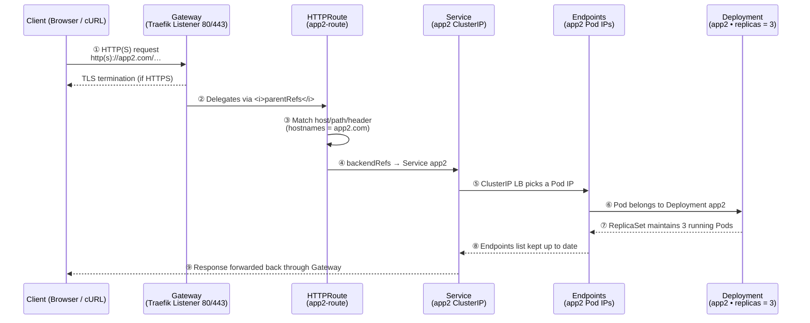

# Use Ingress to access the application

Ingress is a Kubernetes resource that manages external access to services in a cluster, typically HTTP. It provides a way to expose your application to the outside world.

## What is the difference between API Gateway and Ingress and Gateway API?

## Gateway API

### API Overview (Roles and CRDs)

### How the config works

